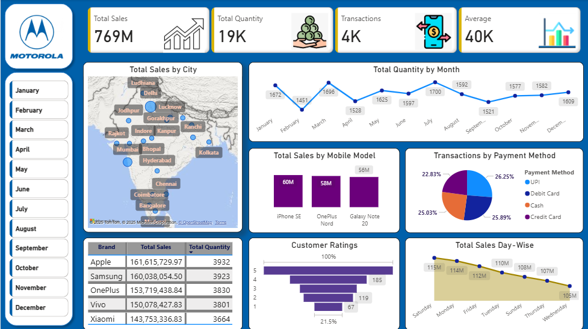

# 📊 Mobile Sales Dashboard (Power BI)

This is an interactive Power BI dashboard that analyzes mobile phone sales data across brands, cities, models, and payment methods. The dashboard provides clear visual insights into total sales, quantity sold, customer ratings, and trends — helping stakeholders make data-driven decisions.

---

## 📷 Dashboard Preview

---

## 📁 Files Included

| File Name                             | Description                                 |
|---------------------------------------|---------------------------------------------|
| `Mobile_sales_dashboard_project.pbix` | Power BI Dashboard File                     |
| `Mobile Sales Data.xlsx`              | Raw Sales Dataset (Used as data source)     |
| `dashboard_preview.png`               | Screenshot of the Dashboard (for README)    |

---

## 🧰 Tools Used

- **Power BI** – For data visualization & dashboard design
- **DAX** – To create measures and KPIs
- **Excel** – For initial data formatting and input
- **Power Query** – For cleaning and transforming the dataset

---

## 📈 Key Features

### ✅ Sales Metrics Cards:
- **Total Sales**: ₹769M  
- **Total Quantity**: 19K units  
- **Transactions**: 4K  
- **Average per Transaction**: ₹40K

### 🗺️ City-Wise Sales Analysis
- Map visualization shows sales performance by location  
- Highlighting top cities like Mumbai, Chennai, Hyderabad, and more

### 📉 Quantity Sold per Month
- Trend line showing quantity sold over 12 months  
- Identifies peak sales periods like August & April

### 📊 Mobile Model Sales
- Bar chart showing sales volume by mobile model: iPhone SE, OnePlus Nord, Galaxy Note 20

### 💳 Payment Method Analysis
- Pie chart comparing UPI, Debit Card, Credit Card, and Cash transactions

### 🏆 Brand-Wise Sales
- Table view of Apple, Samsung, OnePlus, Vivo, and Xiaomi with total quantity and sales

### 🌟 Customer Ratings
- Horizontal bar showing satisfaction scores

### 📅 Day-Wise Sales Trend
- Analyzing performance across weekdays and weekends

---

## 📂 Folder Structure
Mobile-Sales-Dashboard/
├── dashboard-files/
│ ├── Mobile_sales_dashboard_project.pbix
│ ├── Mobile Sales Data.xlsx
│ └── dashboard_preview.png
└── README.md

## 🛠️ How to Use

1. Clone/download this repository to your local machine
2. Open the `.pbix` file in Power BI Desktop
3. Review the visuals, measures, and data relationships
4. You can also explore the Excel file if you want to modify or update the data

---

## 👩‍💻 Author

**Isha Khatana**  
💼 Aspiring Data Analyst | 💡 Passionate about Visualization | 📊 Skilled in Power BI, Excel, SQL, DAX

---

## 📄 License

This project is released under the [MIT License](LICENSE).  
You are free to use, share, and build upon it with proper credits.

---

## 🙌 Feedback or Contributions?

Feel free to **fork** this project, suggest changes, or open an **issue** if you want to collaborate or improve it!

